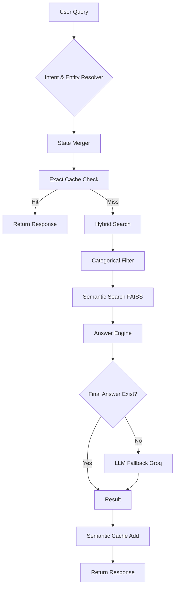

# 🏗️ Commerce RAG Architecture & Core Logic

This document provides a deep-dive into the technical implementation and business logic of the Commerce RAG Assistant.

---

## 🌊 Core Logic Flow

The system follows a strict, layered flow to ensure maximum performance and accuracy.

---

## 🧠 Intelligence Layers

### 1. Intent Detection (`intent.py`)
Queries are classified into specific e-commerce intents using optimized regular expressions.
- `availability_product`: Checking if an item is in stock.
- `price_product`: Asking for the price of a specific item.
- `price_min / price_max`: Looking for the cheapest or most expensive items.
- `list_category_products`: Browsing a specific category.

### 2. Entity Resolution (`entity.py`)
This layer identifies **Products** and **Categories** using a tiered approach:
1.  **Exact Normalization**: Stripping punctuation and whitespace for a direct dictionary match.
2.  **Multilingual Mapping**: Special handling for Bangla synonyms (e.g., `নুডলস` -> `noodles`).
3.  **Fuzzy Matching**: Uses `RapidFuzz` to handle typos (e.g., "Basundhara Noddles" matching "Basundhara Noodles").

### 3. Session State Inheritance (`resolver.py`)
The "magic" that makes the chat feel human. The system handles **Anaphora Resolution** without an LLM.
- **Vague Reference Handling**: Detects tokens like *"it"*, *"this one"*, *"ওটা"*, *"দাম কত"*.
- **State Merge**: If a query is vague and has no product/category, it "inherits" the `active_product` or `active_category` from the previous turn in the session.

---

## ⚡ Performance Strategies

### Two-Tier Caching
1.  **Exact Cache**: Keys are built from `(session_id, intent, product, category)`. This ensures that identical queries in the same context return in <5ms.
2.  **Semantic Cache**: If exact cache fails, the query is compared against a history of resolved queries using FAISS. If the semantic distance is low enough, the previous answer is reused.

### Retrieval Strategy
- **Structured First**: The system always tries to find specific columns in the `products.json` catalog first.
- **FAISS Fallback**: If structured matching fails, semantic search is used to find the most relevant items in the vector space.

---

## 📁 Critical Components

- **Answer Engine (`answer_engine.py`)**: A rule-based system that constructs the final string. It avoids "hallucinations" by only using data present in the search results.
- **State Store (`state.py`)**: Manages session data across Redis or local memory.
- **Retriever (`retriever.py`)**: Interface for FAISS indexing and searching.
